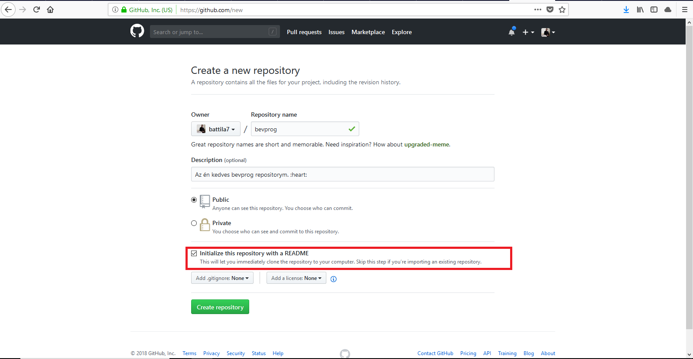
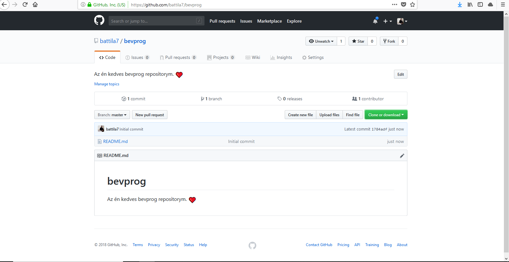

# git-bevprog

> Git gyorstalpaló Bevprogra :rocket: :unicorn:

Egy nagyon rövid bevezetés, kizárólag a legszükségesebbekről, a Bevprog túléléséhez.

Vágjunk bele! Get codin'!

## Mi az a git? Mi az a GitHub?

Habár a kettő közti határ könnyen elmosódhat, a git és a GitHub egymástól teljesen független.

A git (https://git-scm.com/) egy verziókezelő alkalmazás. Segítségével úgynevezett *repositorykat* (röviden repo vagy repó) készíthetünk, melyeken belül a git képes fájlok különböző verzióit nyilvántartani.

A GitHub (https://github.com/) ezzel szemben egy gitre épülő szolgáltatás, amely a repositoryk tárolása mellett számtalan kényelmi funkciót biztosít.

Lássuk először, hogy mire képes a git!

## git

### Miért van szükségünk verziókezelésre?

A verziókezelő rendszerek használata mögötti elsődleges mozgatórugó a projektek hatékonyabb kezelése. Ez magában foglalja például a következőket:

  * A projekthez tartozó fájlok korábbi verzióinak elérése, vizsgálata. Röviden, nem szeretnénk sosem elveszíteni a megelőző verziókat, fenn szeretnénk tartani a lehetőséget, hogy bármikor visszalépjünk az időben. Ez hasznos lehet, ha például egy rossz módosítást csináltunk, és szeretnénk a legutóbbi jó verziót elővenni.
  * Az eltérések vizsgálata a jelenlegi és valamely megelőző állapot között (diff).
  * Több ember egyidejű munkájának lehetővé tétele ugyanazon a kódbázison, anélkül, hogy egymással interferálnának. Ez elősegíti a csapatmunkát.

A git természetesen mindezt biztosítja, és még jóval többet is!

### git alapfogalmak

A git használata előtt meg kell ismerkednünk annak terminológiájával, az általa használt fogalmakkal.

#### Repository

A git úgynevezett repositoryk nyilvántartására képes. Egy repository tartalmazza egy projekt teljes történetét (azaz az összes módosítást), annak létrehozásától kezdve.

#### Commit

Egy repository története felrajzolható egy gráfként, melyben a csúcsokat commitoknak nevezzük. Egy commit lényegében egy pillanatfelvétel a projekt egy adott pillanatbeli állapotáról. Minden commit rendelkezik a következőkkel:

  * *tree*: a projekt commitnak megfelelő állapota,
  * *author*: információ arról a személyről (vagy más entitásról), aki létrehozta a commitot. Tartalmaz egy nevet, egy email címet és egy időbélyeget.
  * *committer*: adatok arról a személyről, aki hozzáadta a commitot a repositoryhoz. Általában ugyanaz, mint az *author*.
  * *commit message*: Egy rövid szöveges üzenet, mely leírja, milyen változásokat vezetbe a commit.
  * *parent commits*: minden commit rendelkezhet egy vagy több szülő committal.

A commitok lényege, hogy egy vagy több fájlon végrehajtott, összetartozó módosításokat írnak le. Később a commitok teszik lehetővé, hogy visszafelé utazzunk az időben.

#### Branch

Lehetséges, hogy a projektet egyszerre több, egymástól független ágon is fejlesszük, mely ágakat brancheknek nevezzük. Később ezek az ágak összetalálkozhatnak, ezt hívjuk merge-nek.

### Telepítés

A git elérhető [Windowsra](https://git-scm.com/download/win) és [Linuxra](https://git-scm.com/download/linux) is. Mi több, sok Linux disztribúció már eleve tartalmazza.

Annak ellenőrzése, hogy a git telepítve van-e, rendkívül egyszerű. Csupán adjuk ki a következő parancsot a terminálban:

~~~~bash
git
~~~~

### Bemutatkozás

Mielőtt bármibe belekezdenénk, mondjuk el a gitnek, hogy kik vagyunk. Ezt ugye el fogja tárolni az általunk létrehozott commitokban.

A nevünket és az email címünket a következő két paranccsal adhatjuk meg:

~~~~bash
git config --global user.name "Ash Ketchum"
git config --global user.email nevalaszoljon@mav-start.hu
~~~~

> FONTOS! A GitHub fiók létrehozásánál mindenképpen ugyanezt a címet adjuk meg!

### Egy esettanulmány - Bevprog git

A git alapszintű használatát egy képzeletbeli Bevprog repositoryn fogjuk kipróbálni! Ennek során megismerjük a legfontosabb parancsokat, valamint a git munkamenetét.

#### Létrehozás

Hozzunk létre egy `bevprog` nevű mappát, és lépjünk bele:

~~~~bash
mkdir bevprog
cd bevprog
~~~~

Ezt követően adjuk ki az `init` parancsot:

~~~~bash
git init
~~~~

~~~~bash
# Kimenet
Initialized empty Git repository in /valahol/valami/bevprog/.git/
~~~~

Ezzel az aktuális mappában (ami a `bevprog`), létrehoztunk az új repositoryt. Vegyük észre, hogy a kimenet végén a `.git` mappa szerepel. Ez egy rejtett mappa, amiben a git a repository történetét tárolja.

#### Állapot

Ahogy az korábban szerepelt, a git nyomon tudja követni a repository tartalmának változását. Így azt is meg tudja mondani, hogy rendelkezünk-e olyan módosítással, amit esetleg még nem adtunk hozzá commithoz.

Bár még nem végeztünk semmilyen változtatást, adjuk ki a következő parancsot:

~~~~bash
git status
~~~~

~~~~bash
# Kimenet
On branch master

No commits yet

nothing to commit (create/copy files and use "git add" to track)
~~~~

Láthatjuk, hogy a `master` nevű branchen vagyunk (amikor a git létrehoz egy repositoryt, automatikusan készít egy ilyen branchet), még nem készült egy commit sem, és nincsen semmilyen commitolható változtatás. Még! De majd most!

#### Hello, World!

Készítsük el a jól ismert `Hello, World!` program megoldását C-ben! Írjuk bele a `hello.c` nevű fájlba a következőket:

~~~~C
#include <stdio.h>

int main(int argc, char **argv) {
    printf("Hello, World!\n");

    return 0;
}
~~~~

Ne felejtsük el elmenteni a fájlt!

Most, hogy már csináltunk is valamit, adjuk ki újra a `status` parancsot:

~~~~bash
git status
~~~~

~~~~bash
# Kimenet
On branch master

No commits yet

Untracked files:
  (use "git add <file>..." to include in what will be committed)

        hello.c

nothing added to commit but untracked files present (use "git add" to track)
~~~~

Hohó! :unicorn: A git észrevette, hogy a `hello.c` egy úgynevezett untracked fájl. Ez azt jelenti, hogy egy új fájlról beszélünk, a repository megelőző állapotában ez a fájl nem volt jelen. 

#### Út Commitföldére

Készítsünk ebből a módosításból egy commit!

Előbb azonban még meg kell értenünk a git munkafolyamat három legfontosabb területét, melyek a working directory, a staging area és a .git könyvtár. 

  * A working directory gyakorlatilag maga a könyvtár, amiben a repository található. Itt tetszőleges módosításokat végezhetünk, ezeket még nem menti el a git. Ha azt képzeljük, hogy van egy íróasztalunk, akkor a working directory azokat a lapokat jelenti, melyekre éppen írunk.
  * A következő a staging area. Mielőtt a módosításainkból commit lesz, előbb elhelyezzük őket a staging areaban. Visszatérve az íróasztalhoz, ezek olyan lapok, melyekkel már elégedettek vagyunk, és melyeket félreraktunk. Még azonban elképzelhető, hogy újra módosítjuk őket.
  * Végül, a .git könyvtárban lesznek a commitok. Ide a staging areaból kerülnek át a módosítások egy commit formájában. Ez az íróasztalunk fiókja. Ha valamit commitolunk, arra onnantól kezdve már vigyázni fog a git.

E rövid mellékdalt követően már **TÉNYLEG** commitot fogunk készíteni!

Először helyezzük el a módosítást a *staging area*-ban. Erre az `add` parancs szolgál:

~~~~bash
git add hello.c
~~~~

~~~~bash
# Kimenet
# Nincs kimenet, ha jók voltunk.
~~~~

Az `add` parancsnak tetszőlegesen sok elérési utat megadhatunk, szóközökkel elválasztva.

Nézzük, milyen állapotban van most a repository:

~~~~bash
git status
~~~~

~~~~bash
# Kimenet
On branch master

No commits yet

Changes to be committed:
  (use "git rm --cached <file>..." to unstage)

        new file:   hello.c
~~~~

A git előzékenyen tájákoztat minket, hogy mely változtatások fognak belekerülni a commitba. Láthatjuk, hogy a commit egy új fájlt, a `hello.c`-t fogja tartalmazni. Ne is várjunk tovább, készítsük el a commitot:

~~~~bash
git commit -m "Look, mum, I have created a commit!"
~~~~

~~~~bash
# Kimenet
[master (root-commit) 2acce9b] Look, mum, I have created a commit!
 1 file changed, 7 insertions(+)
 create mode 100644 hello.c
~~~~

Egy változtatás, egy új fájl! Ezt most már tartalmazza a commit gráf. Nézzük, mi most a working directory és a staging are állapota:

~~~~bash
git status
~~~~

~~~~bash
# Kimenet
On branch master
nothing to commit, working tree clean
~~~~

Mivel minden változtatást commitoltunk, így teljesen tiszta mind a working directory, mind a staging area.

#### Egy újabb módosítás - diff

Tegyük fel, hogy `Hello, World!` helyett inkább azt szeretnénk kiírni, hogy `Hello darkness, my old friend`. Ekkor a `hello.c` a következőképpen módosul:

~~~~C
#include <stdio.h>

int main(int argc, char **argv) {
    printf("Hello darkness, my old friend\n");

    return 0;
}
~~~~

Nézzük, mit jelent ez statust illetően:

~~~~bash
git status
~~~~

~~~~bash
# Kimenet
On branch master
Changes not staged for commit:
  (use "git add <file>..." to update what will be committed)
  (use "git checkout -- <file>..." to discard changes in working directory)

        modified:   hello.c

no changes added to commit (use "git add" and/or "git commit -a")
~~~~

A git ismét észrevette, hogy változtattunk, azonban `new file` helyett most csuoán `modified` látható, hiszen ezúttal csak módosítottunk egy fájlt, és nem hoztunk létre semmi újat.

Tegyük fel, hogy elmegyünk bulizni, teljesen véletlenül másnap nehezen emlékszünk arra, hogy milyen módosításokat végeztünk. Semmi baj (legalábbis, ami a gitet illeti)! Próbáljuk ki a `diff` parancsot:

~~~~bash
git diff
~~~~

~~~~
# Kimenet
diff --git a/hello.c b/hello.c
index 1a78a8b..953f89a 100644
--- a/hello.c
+++ b/hello.c
@@ -1,7 +1,7 @@
 #include <stdio.h>

 int main(int argc, char **argv) {
-    printf("Hello, World!\n");
+    printf("Hello darkness, my old friend\n");

     return 0;
 }
~~~~

A `diff` parancs rendkívül akkurátusan tájékoztat bennünket, hogy mi a különbség a working directory tartalma és a legutolsó commit között. Ha a staging area és a legutolsó commit közti különbségre vagyunk kíváncsiak, akkor a `git diff --staged` parancsot használhatjuk.

#### Mégsem módosítunk

Az előző módosítással még nem csináltunk semmit, továbbra is a working directoryban található. Mivel mégsem vagyunk olyan nagy Simon & Garfunkel rajongók, ezért inkább úgy döntünk, maradni szeretnénk az eredeti `Hello, World!` üzenetnél.

Persze, átírhatjuk kézzel is a fájl tartalmát, azonban az magában hordozza a hiba lehetőségét, valamint nagyobb módosítások esetén kényelmetlen is.

Használjuk inkább a `checkout` parancsot! Ennek segítségével a working directory megfelelő fájljának tartalmát visszaállíthatjuk a legutóbbi commitban levő változatra:

~~~~
git checkout hello.c
~~~~

~~~~bash
# Kimenet
# Nincs kimenet, ha jók voltunk
~~~~

Most egy `diff`:

~~~~bash
git diff
~~~~

~~~~bash
# Kimenet
# Nincs kimenet, ha jók voltunk.
~~~~

> Ha egy módosítást az `add` paranccsal már a staging areaba raktunk, és onnan szeretnénk visszahúzni a working directoryba, akkor használjuk a `git reset <fájlnév>` parancsot!

#### Commit és mégsem

Újra egy tiszta working directoryval bírunk. Maszatoljuk ezt össze, mi több készítsünk egy helytelen commitot, majd utazzunk vissza a múltba, hogy javítsuk a hibánkat!

Írjuk át a `hello.c` tartalmát a következőre:

~~~~C
#include <stdio.h>

int main(int argc, char **argv) {
    printf("Hello, World!") // lemaradt a kis virgonc ;

    return 0;
}
~~~~

`add` és `commit`:

~~~~bash
git add hello.c
git commit -m "Is it too late now to say sorry?"
~~~~

Kész is a commit. Erről megbizonyosodhatunk a `log` parancs segítségével is:

~~~~bash
git log
~~~~

~~~~bash
# Kimenet
commit fad5c4826d3ec93f6acf82ada0947bedb1f672ed (HEAD -> master)
Author: Attila Bagossy <bagossyattila@outlook.com>
Date:   Tue Sep 25 00:24:38 2018 +0200

    Is it too late now to say sorry?

commit 2acce9bbf5b4c5ab9d06205227b8b125a88a2203
Author: Attila Bagossy <bagossyattila@outlook.com>
Date:   Tue Sep 25 00:02:37 2018 +0200

    Look, mum, I have created a commit!
~~~~

Már épp mennénk elújságolni a szüleinknek, hogy milyen szuper programot írtunk, hátha nem kell vacsora után mosogatni, azonban észrevesszük, hogy van egy hiba! Nincsen pontosvessző. Ez a commit kicsit elhamarkodott lett...

Szerencsére van megoldás, a legutolsó commit tartalmát visszarakhatjuk a working directoryba a `reset` használatával:

~~~~bash
git reset HEAD~1
~~~~

~~~~bash
# Kimenet
Unstaged changes after reset:
M       hello.c
~~~~

A `hello.c`-ben végzett változtatásaink újra csupán a working directoryban vannak. Ha megnézzük, a commit már sehol sincs:

~~~~bash
git log
~~~~

~~~~bash
# Kimenet
commit 2acce9bbf5b4c5ab9d06205227b8b125a88a2203 (HEAD -> master)
Author: Attila Bagossy <bagossyattila@outlook.com>
Date:   Tue Sep 25 00:02:37 2018 +0200

    Look, mum, I have created a commit!
~~~~

Csudi! :tada:

A szokott módon állítsuk vissza a `hello.c` tartalmát, hiszen itt véget ért az esettanulmány:

~~~~
git checkout hello.c
~~~~

### Egy esettanulmány - Bevprog GitHub

Eddig a munkánkat a saját gépünkön végeztük, nem látta azt senki, csak mi. A GitHub lehetővé teszi, hogy másokkal is megosszuk a repositorynkat.

A következőkben készíteni fogunk egy bevprog repositoryt a GitHubon!

Most én elmegyek, iszok egy pohár vizet, addig kérlek, hozz létre magadnak egy GitHub fiókot.

#### Új repository

Hozzunk létre egy új repositoryt ezúttal a GitHubon! Ehhez látogassuk meg a következő linket:

  * https://github.com/new

Töltsük ki a megfelelő mezőket, és ikszeljük be a pirossal bekeretezett checkboxot. Így alapból kapunk egy README.md nevű fájlt. Ebben helyezhetjük el a repositoryban található projekt leírását.

Kattintsunk végül a `Create repository` gombra!

#### Az én kedves GitHub repositorym.

Ezzel elkészül az új repository.

Láthatjuk, hogy egy fájlból (`README.md`) és egy commitból áll (`Initial commit`).

#### A klónok támadása

Ez a repository remek, azonban szeretnénk a README-ben elhelyezni a nevünket. Ehhez le kell klónozni a repositoryt. Vegyük elő a terminált és adjuk ki a következő parancsot:

~~~~bash
git clone https://github.com/battila7/bevprog
~~~~

~~~~bash
# Kimenet
Cloning into 'bevprog'...
remote: Enumerating objects: 3, done.
remote: Counting objects: 100% (3/3), done.
remote: Compressing objects: 100% (2/2), done.
remote: Total 3 (delta 0), reused 0 (delta 0), pack-reused 0
Unpacking objects: 100% (3/3), done.
~~~~

Természetesen a `https://github.com/battila7/bevprog` címet cseréljük ki a saját repositorynk címére. Ezzel a `bevprog` mappába klónozásra került az újonnan létrehozott repository.

#### Névjegyünk

Váltsunk a `bevprog` könyvtárba és írjuk bele a `README.md`-be a nevünket:

~~~~md
# bevprog
Hétszünyű Kapanyányimonyók kedves bevprog repositoryja. :heart:
~~~~

`add` és `commit`:

~~~~bash
git add README.md
git commit -m "My name is Bond, James Bond."
~~~~

Lássunk egy statust:

~~~~bash
git status
~~~~

~~~~bash
# Kimenet
On branch master
Your branch is ahead of 'origin/master' by 1 commit.
  (use "git push" to publish your local commits)

nothing to commit, working tree clean
~~~~

A lényeg a harmadik sorban található. Azt írja, hogy a branchünk az `origin/master` előtt van egy committal. A lokális változtatásaink közzétételéhez a `push` parancsot használhatjuk.

#### Push it!

Tegyünk is így, pusholjunk!

~~~~bash
git push
~~~~

~~~~bash
# Kimenet
Counting objects: 3, done.
Delta compression using up to 4 threads.
Compressing objects: 100% (2/2), done.
Writing objects: 100% (3/3), 333 bytes | 333.00 KiB/s, done.
Total 3 (delta 0), reused 0 (delta 0)
To https://github.com/battila7/bevprog
   1784adf..d6d4a79  master -> master
~~~~

Feltehetőleg meg kell adnunk a GitHub email címünket és jelszavunkat, mielőtt a tényleges push megtörténne. Azonban, ha megvolt a push, bátran megnézhetjük GitHubon is a repository tartalmát!

## További források

Ez a lehető legminimálisabb gyorstalpaló volt, korántsem egy teljes körkép a gitről. Ahhoz, hogy magabiztosan tudjuk használni a gitet, rengeteg gyakorlás és kísérletezés, valamint további tanulás szükséges. Javallottak a következő források:

  * Cheat Sheet - https://services.github.com/on-demand/downloads/github-git-cheat-sheet.pdf
  * Hivatalos git videók - https://git-scm.com/videos
  * Become a git guru - Atlassian Tutorials - https://www.atlassian.com/git/tutorials
  * Kicsit több a GitHubról - GitHub Guides - https://guides.github.com/

Ennél jóóóóóóval több fantasztikus forrás található a neten (vagy írásban), a fentieket csupán kiindulási pontnak szántam.

Hajrá! :rocket:
